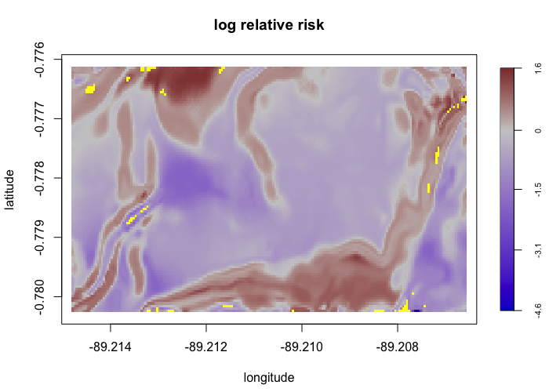
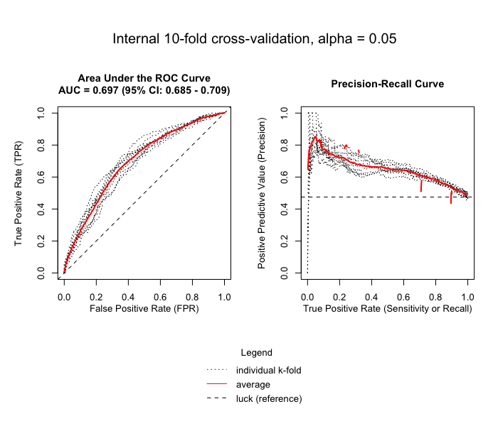

envi: Environmental interpolation using spatial kernel density estimation 
===================================================

<h2 id="overview">

Overview

</h2>

The `envi` package is a suite of `R` functions to estimate the ecological niche of a species and predict the spatial distribution of the ecological niche -- a version of environmental interpolation -- with spatial kernel density estimation techniques. A two group comparison (e.g., presence and absence locations of a single species) is conducted using the spatial relative risk function that is estimated using the [sparr](https://CRAN.R-project.org/package=sparr) package. Internal cross-validation and basic visualization are also supported. 

<h2 id="install">

Installation

</h2>

To install the release version from CRAN:

    install.packages("envi")

To install the development version from GitHub:

    devtools::install_github("idblr/envi")

<h2 id="available-functions">

Available functions

</h2>

<table>
<colgroup>
<col width="30%" />
<col width="70%" />
</colgroup>
<thead>
<tr class="header">
<th>Function</th>
<th>Description</th>
</tr>
</thead>
<tbody>
<td><code>lrren</code></td>
<td>Main function. Estimate an ecological niche using the spatial relative risk function and predict its location in geographic space.</td>
</tr>
<td><code>plot_obs</code></td>
<td>Easily make multiple plots of the estimated ecological niche from <code>lrren</code> output.</td>
</tr>
<td><code>plot_predict</code></td>
<td>Easily make multiple plots of the predicted spatial distribution from <code>lrren</code> output.</td>
</tr>
<td><code>plot_cv</code></td>
<td>Easily make multiple plots of internal k-fold cross-validation diagnostics from <code>lrren</code> output.</td>
</tr>
</tbody>
<table>

## Usage
```r
# ------------------ #
# Necessary packages #
# ------------------ #

library(envi)
library(raster)
library(spatstat.core)
library(spatstat.data)

# -------------- #
# Prepare inputs #
# -------------- #

# Using the `bei` and `bei.extra` data from {spatstat.data}

# Environmental Covariates
elev <- spatstat.data::bei.extra$elev
grad <- spatstat.data::bei.extra$grad
elev$v <- scale(elev)
grad$v <- scale(grad)
elev_raster <- raster::raster(elev)
grad_raster <- raster::raster(grad)

# Presence locations
bei <- spatstat.data::bei
spatstat::marks(bei) <- data.frame("presence" = rep(1, bei$n),
                                        "lon" = bei$x,
                                        "lat" = bei$y)
spatstat::marks(bei)$elev <- elev[bei]
spatstat::marks(bei)$grad <- grad[bei]

# (Pseudo-)Absence locations
set.seed(1234) # for reproducibility
absence <- spatstat::rpoispp(0.008, win = elev)
spatstat::marks(absence) <- data.frame("presence" = rep(0, absence$n),
                                       "lon" = absence$x,
                                       "lat" = absence$y)
spatstat::marks(absence)$elev <- elev[absence]
spatstat::marks(absence)$grad <- grad[absence]

# Combine
obs_locs <- spatstat::superimpose(bei, absence, check = FALSE)
plot(obs_locs, which.marks = "presence")
obs_locs <- spatstat::marks(obs_locs)
obs_locs$id <- seq(1, nrow(obs_locs), 1)
obs_locs <- obs_locs[ , c(6, 2, 3, 1, 4, 5)]

# Prediction Data
predict_locs <- data.frame(raster::rasterToPoints(elev_raster))
predict_locs$layer2 <- raster::extract(grad_raster, predict_locs[, 1:2])

# ----------- #
# Run lrren() #
# ----------- #

test <- lrren(obs_locs = obs_locs,
              predict_locs = predict_locs,
              predict = TRUE,
              cv = TRUE)

# -------------- #
# Run plot_obs() #
# -------------- #

plot_obs(test)

# ------------------ #
# Run plot_predict() #
# ------------------ #

plot_predict(test, cref0 = "+init=epsg:5472", cref1 = "+init=epsg:4326")

# ------------- #
# Run plot_cv() #
# ------------- #

plot_cv(test)

```








